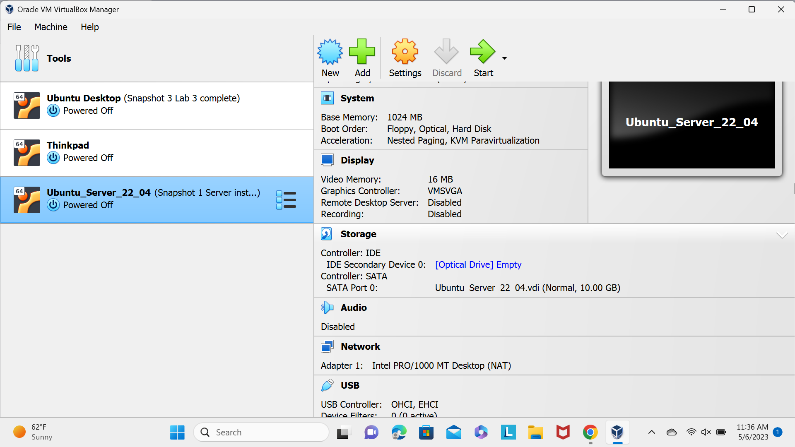
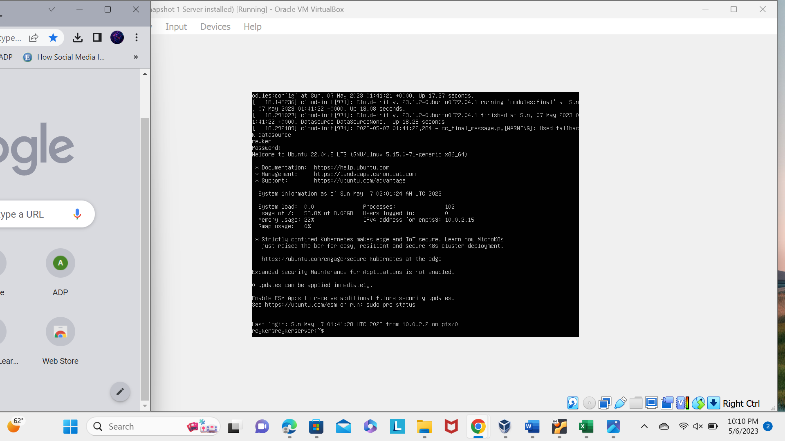
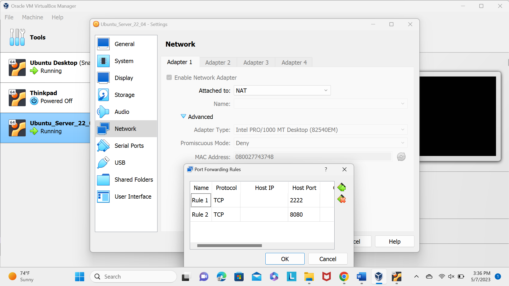
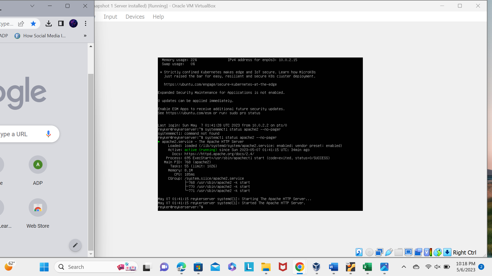
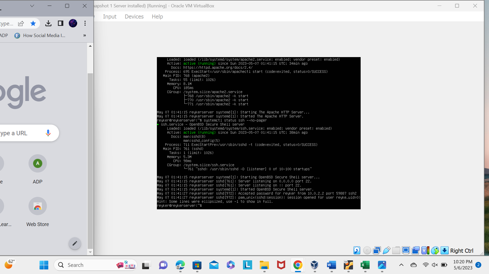
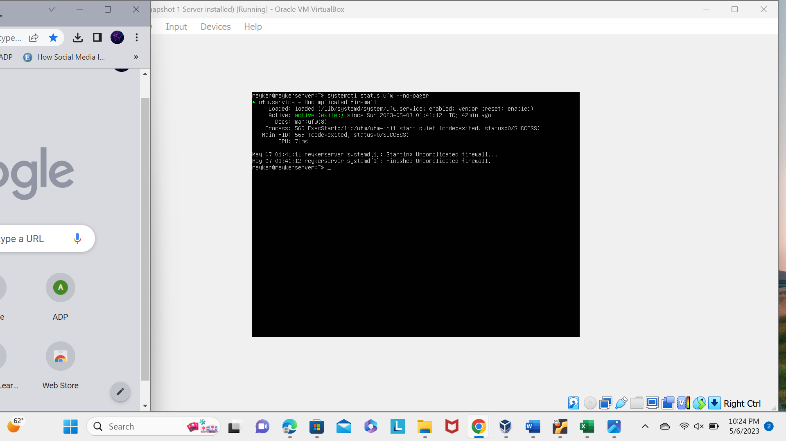
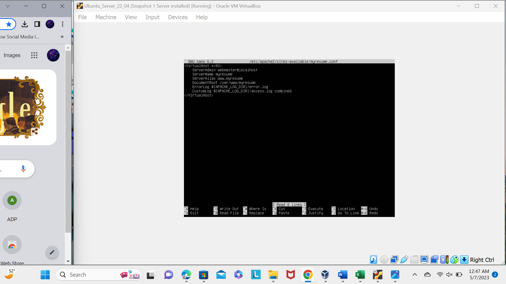
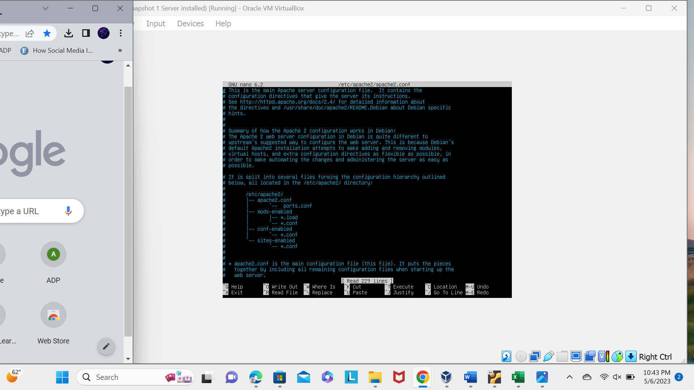
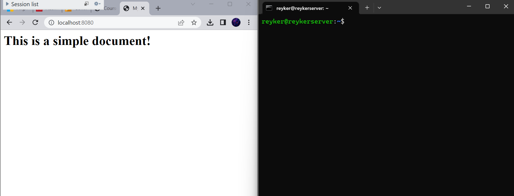

 
This screenshot is virtual machine hardware configuration.

 
 This screenshot od the login screen to the server.

 
This screenshot of connecting to the server with ssh from my Ubuntu.

 
This screenshot systemctl status apache2 --no-pager.

 
This screenshot systemctl status sshd apache2 --no-pager.

 
This screenshot systemctl status ufw apache2 --no-pager.

 
This screenshot of sites-available config file.

 
This screenshot of apache2.conf

 
