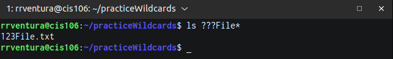
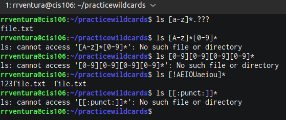
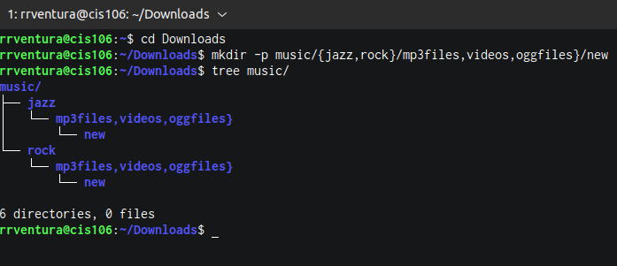

# Week Report 6

## Wildcards .

### * Wildcard 
The * wildcard matches from 0 to any number of characters.
* Examples:
  * list all the text file in a directory
    * 'ls *.txt'
* List all the files that start with the word file.
  * 'ls  file*
* Copy all the mp4 files 
* 'cp Downloads/*.mp4 ~/Videos/Videos/Movies/*
   
### ? Wildcard 
The ? wildcard matches a single character.
* Examples:
  * list all the files that have 3 characters and are followed by the word file the name
  
### [] wildcard
The [] wildcard match a single character in range.
* Examples:
  * The all the text file in a directory that a vowel after f.
    * 'ls f[aeiou]*
   * List all the files that start with the world file.
     * ls f[a-z]*
   * Breakdown an example:
   * 'ls -1 do[0-9].doc/
  
## # Brace Expansion 
Brace expansion {} is not a wildcard but another feature of bash that allows you to generate ar birary string to use with commands.
    * The all the text file in directory structure in a single command:
  * mkdir -p music/{jazz,rock}/{mp3files,videos,oggfiles}/new{1..3}
  
 
