# Week Report 4

## Practice in the presentation The Linux File System:
### practice 1
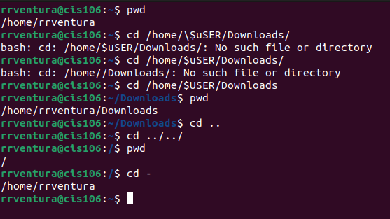 

### practice 2
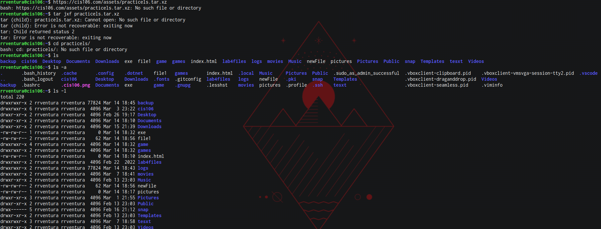 
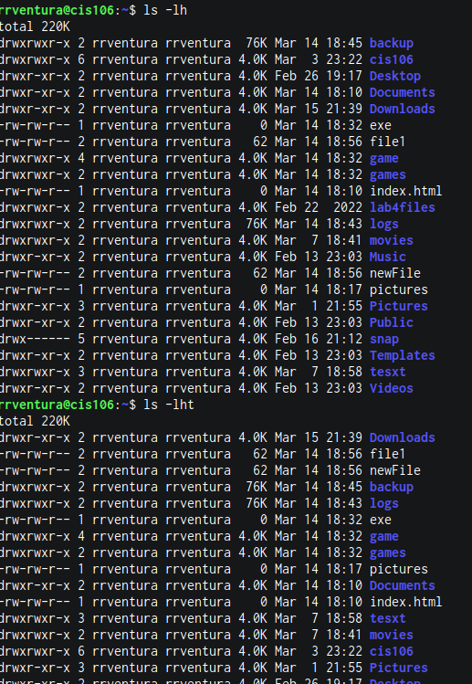 
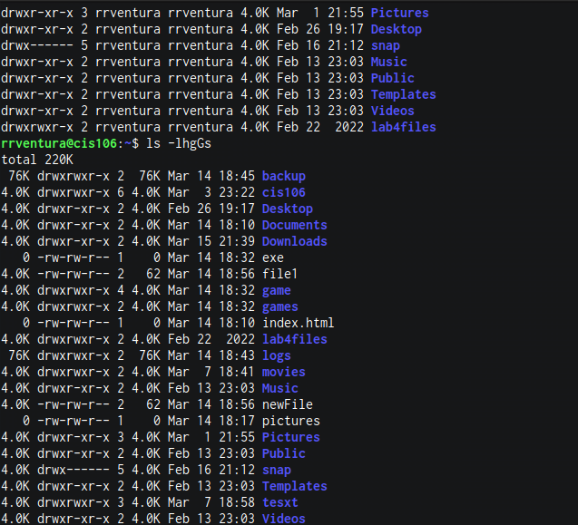 
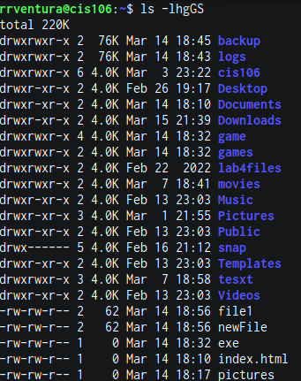 
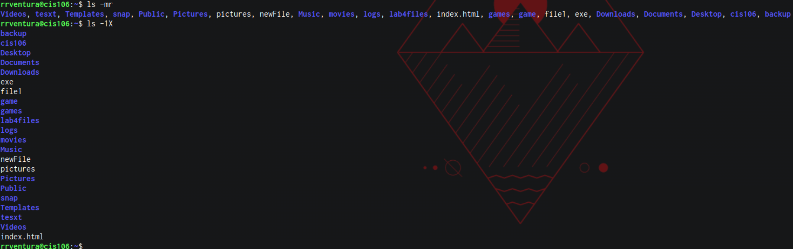 

### practice 3
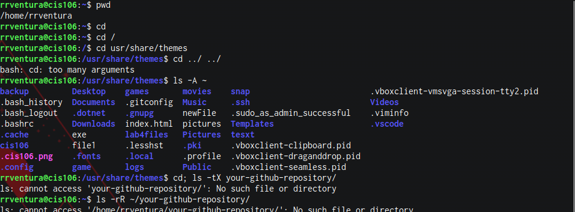 
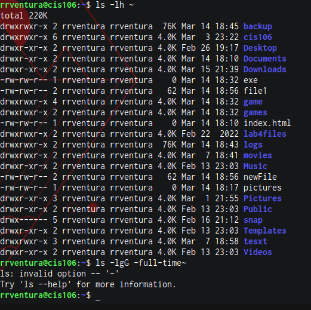 
## The Linux File file system directories and their purpose: 

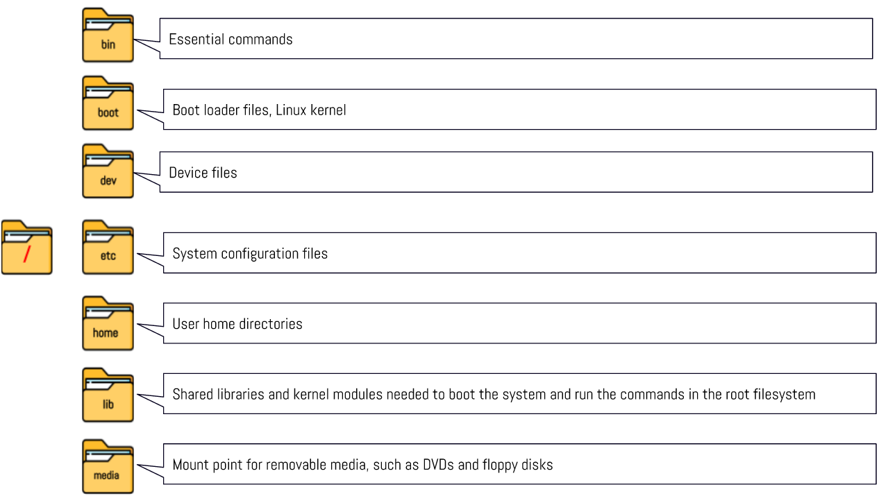 
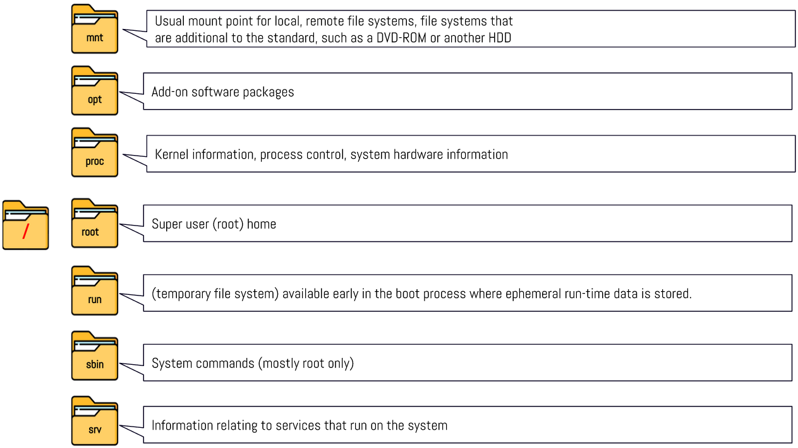 
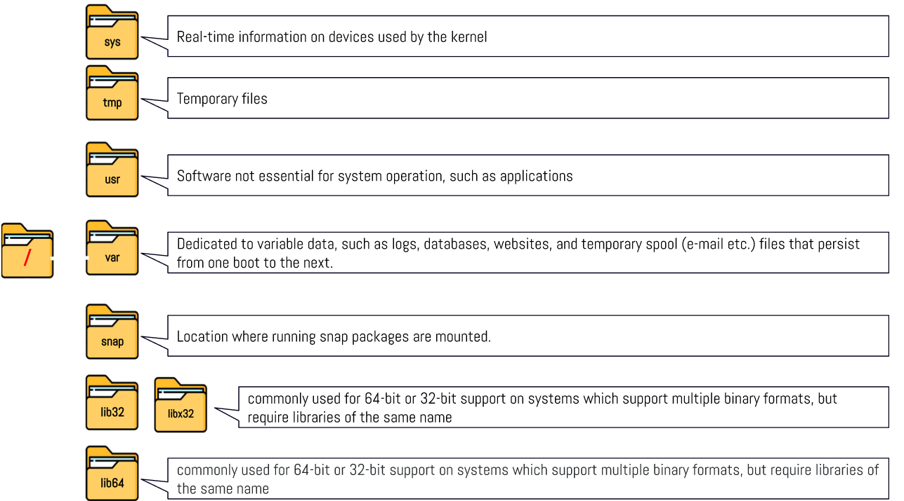 
## All the commands for navigating the filesystem 

| Command | What it does             | Syntax      | Example        |
| ------- | ------------------------ | ----------- | -------------- |
| pwd     | prints current directory | pwd         | 'pwd'          |
| cd      | description here         | syntax here | 'example here' |
| ls      | description here         | syntax here | 'example here' |

## Basic terminology 
* **File system:** the  way files are stored and organized.
  
* **Current directory:** the directory where you are at moment is called the current working directory or present working directory.
  
* **parent directory:** you are always working inside a particular directory and you can move forward to a subdirectory or backwards to the previous directory.
  
* **the difference between your home directory and the home directory:** your home directory is everything come under the roots directory and the home directory is the home directory contains a particular user's data.
  
* **pathname:** In a filesystem every files has a pathname which indicates the location of the in the filesystem (like an address)
  
* **relative path:**  the location of a file starting from the current working directory or a directly that is located inside the current working directory.
  
* **absolute path:** The location of a file starting a the root of the files system.