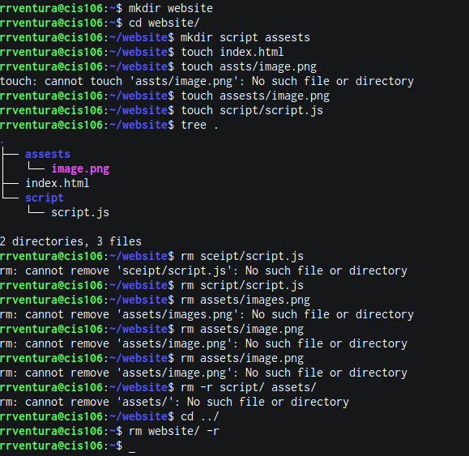

# Week Report 5

## Answer to question:

* **What are Command Options?**
  The command options a character, set of consecutive characters or a word that follows the command and any arguments

* **What are Command Arguments?**
  The command arguments simple parameters that are given on the system's command line.
  
* **Which command is used for creating directories? Provide at least 3 examples.**
  The command is used for creating directories is Mkdir command. 
  Examples: . and ..
  
* **What does the touch command do? Provide at least 3 examples.**
The  command is mkdir.
* example 1:
* create a directory: 'mkdir potatoes'
* example 2:
* create multiple directories: 'mkdir movies ~/Downloads/games ~/Documents/hmw'
  

* **How do you remove a file? Provide an example.**
  Do remove a file to delete all the files in the mkdir directory, one by one, the following rm -1 mkdir / after each file name display, type y and press enter to delete the files.

* **How do you remove a directory and can you remove non-empty directories in Linux? Provide an example**
  The remove a directory and can you remove non-empty directories in Linux used the rm -r command to remove non-empty directories.

* **Explain the mv and cp command. Provide at least 2 examples of each**
  The mv command to move files and directories from one directory to another or rename a file or directory. The cp command for copying files from one location to another.
  Example of cp command : cp rrventura/home/cis106/weekreport.

## Practice 1
 
## Practice 2
 
## Practice 3
 
## Practice 4
 
  
